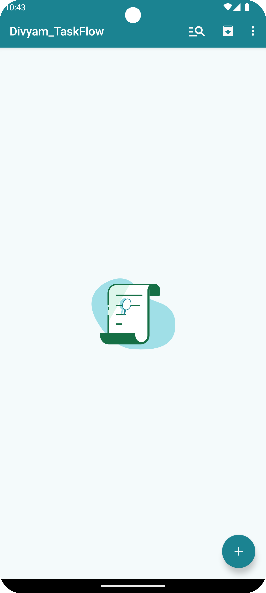
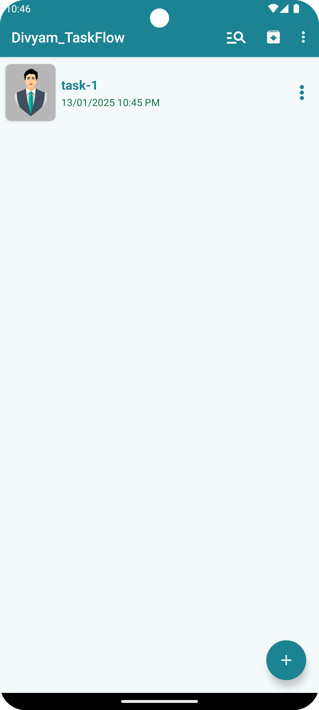
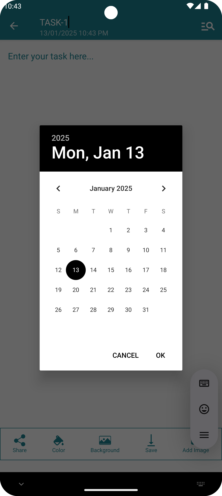
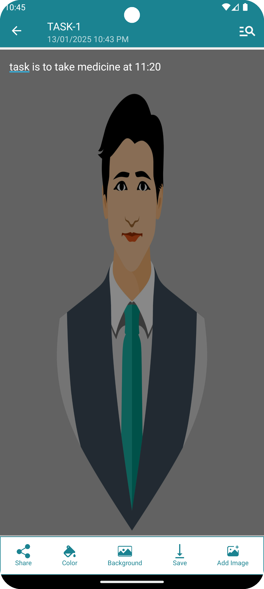
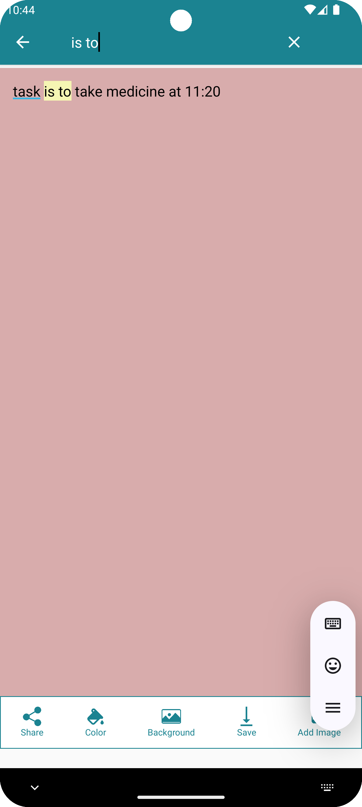

<h1 style="font-size:48px;">✅ TaskFlow</h1>

<h2 style="font-size:36px;">TaskFlow is a simple and efficient to-do list application designed to help you stay organized and productive. With TaskFlow, you can easily manage tasks, track your progress, and ensure nothing falls through the cracks.
</h2>

---

<h2 style="font-size:36px;"> 🌟 Features</h2>

- ✔️ **Task Management**: Add, edit, and delete tasks effortlessly.
- 🗂️ **Task Categories**: Organize tasks by category for better clarity.
- ⏳ **Due Dates**: Set due dates and reminders for your tasks.
- 🎯 **Task Completion**: Mark tasks as completed and track your progress.
- 🎨 **User-Friendly Interface**: A clean and intuitive design to enhance your productivity.

---

<h2 style="font-size:36px;"> 🚀 Installation</h2>

To set up **TaskFlow** on your local machine, follow these simple steps:

- Clone the Repository : git clone https://github.com/divyam082003/taskflow.git

<h2 style="font-size:36px;">Screenshots</h2>

  
  
  
  
  
  

